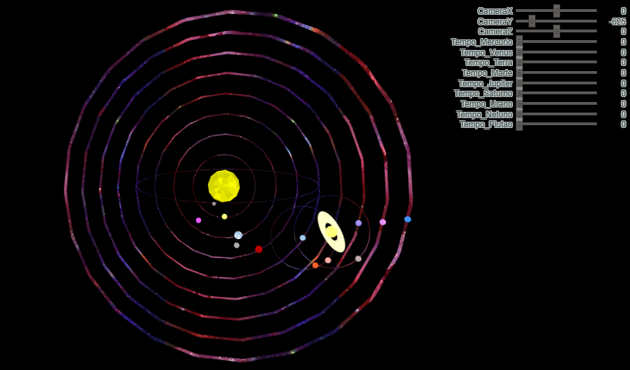

# Trabalho 1 - Sistema Solar
 Implementação de um sistema solar utilizando WebGL2.
 Tendo como código base o programa do tutorial do webgl: https://webglfundamentals.org/webgl/lessons/webgl-scene-graph.html

Funcionalidades:
- [x] Todos os planetas e algumas luas
- [x] Trajetória com base em dados reais
- [ ] Desenhar a trajetória
- [x] Colocar o cometa Halley
- [ ] Colocar textura no planetas
- [x] Implementar um sistema de câmeras legal
- [x] Controlar o tempo com um sliders

